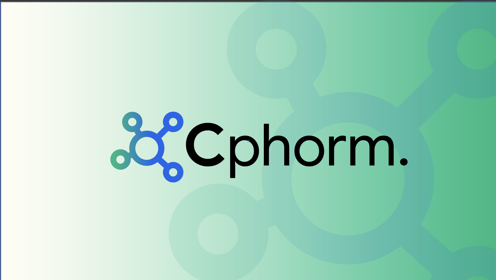

# Cphorm



#### 🧬 Cphorm

A *lightweight*, *offline-first health data collection and synchronization platform* designed for field workers, researchers, and organizations working in connectivity-challenged regions.

#### 🚀 Key Features

* Dynamic form creation - selecting your own parameters 

* Offline data entry & syncing when  online

* Clean web dashboard for accessing data, viewing submissions & regional health patterns 

* Role-based access (enumerators, reviewers)

### 🛠️ Tech Stack
* __Frontend__: React / Next.js / Tailwind CSS

* __Backend__: Flask / Node.js / 

* __Database__: Mongo DB

* __Data Pipeline__: Pandas


### 📦 Folder Structure

``` bash
/cphorm

├── form/
│   ├── back-end
│   └── front-end
├── Platform
│   ├── analytics
│   └── dashboard
        └──components.    
├── utils/           
├── docs/              
└── README.md
```


### Prerequisites

- Node.js

- Python 3.10+

- Docker (optional for deployment)

### Setup
```bash
git clone https://github.com/STACK-42/Cphorm.git
cd cphorm
```
Then follow setup steps for /frontend and /backend in their respective READMEs.

### 📊 Use Cases
- Health survey campaigns

- Rapid response to humanitarian crises (by detecting patterns early)

- Offline-first data collection in rural areas
